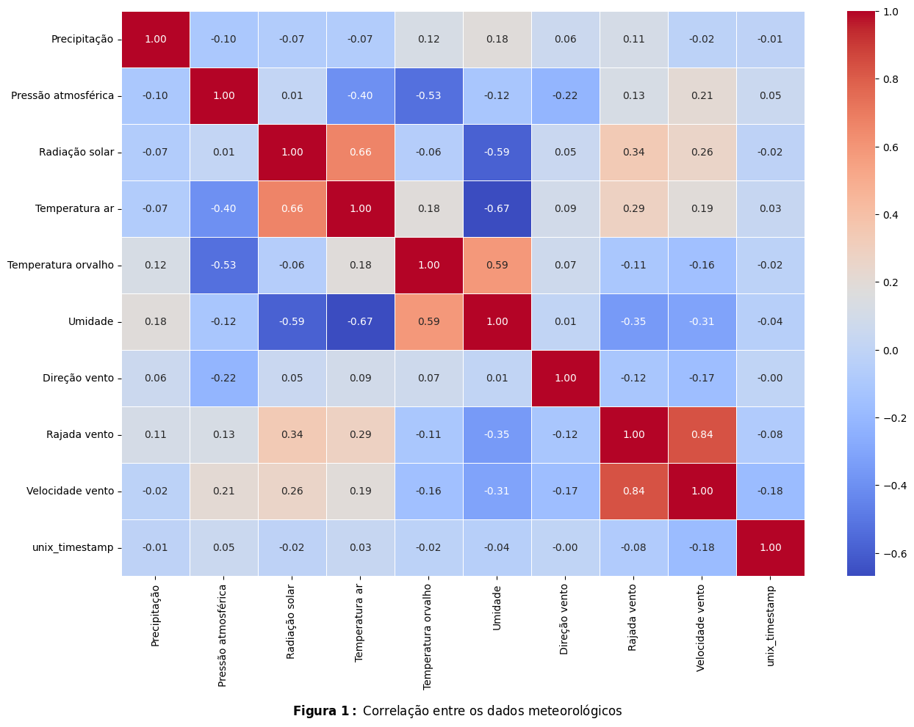
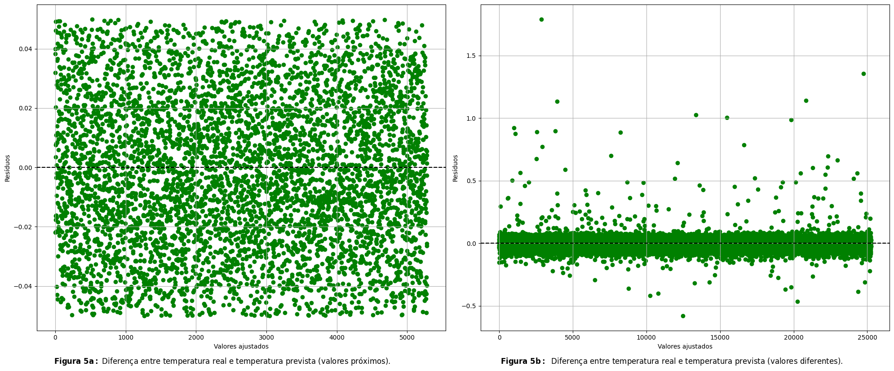

<h1 align="center">
  REDE NEURAL PARA DETERMINAR A TEMPERATURA DO AR
</h1>

# Sobre

 Projeto desenvolvido na disciplina Tópicos Especiais D - Inteligencia Artificial do curso de graduação em Física. O objetivo é aplicar os conhecimentos teóricos adquiridos em sala de aula.

 O objetivo principal foi desenvolver uma Rede Neural Convolucional capaz determinar a temperatura do ar.

# Funcionalidades e Entidades

## Funcionalidades
- ### Carregar os dados para o treinamento
  A função load_data carrega os dados da pasta data e organiza todos em um novo arquivo csv (all_data.csv)

- ### Previsão de saída
  A rede neural pode realizar previsões com base nos dados de entrada fornecidos após ter sido treinada.

## Entidades
- ### Rede Neural
  A arquitetura da rede neural utilizada consiste em um sequência de camadas que incluem um camada de Input, umada de Conv1D, uma camada de MaxPooling1D, uma camada Flatten e 2 camadas Dense, sendo a ultima a saida.

  - **Camada InputLayer**: Camada de entrada que recebe 122131 exemplos com 10 características sendo 1 característica de cada vez.
  - **Camada Conv1D**: Detecta padrões específicos nos dados de entrada ao longo de 1 dimensão.
  - **Camada MaPooling1D**: Reduz a dimensão das características preservando as informações mais importantes. REduz o tamanho dos dados.
  - **Camada Flatten**: Converte a saída da camada anterior em um vetor unidimensional.
  - **Camadas Dense**: Aprende combinações de características extraídas pelas camadas anteriores, atuando como uma camada intermediária, e a última camada dense retorna a saída.

- ### Compilação do Modelo
  O modelo foi compilado usando o otmizador Adam e a função de perda de erro médio absoluto (mae). A métrica de avaliação utilizada foi a raiz quadrada do erro-médio (RootMeanSquaredError)

- ### Treinamento do Modelo
  O modelo foi treinado por aproximadamente x épocas com um lote (batch) igual a 128. Os dados de treinamento e validação foram fornecidos durante o treinamento para monitorar o desempenho do modelo ao longo do tempo. Além disso, foi utilizado um callback de Early Stopping para interromper o treinamento se a perda não melhorasse após 10 épocas.

# Resultados

Neste trabalho, foi utilizado um de rede neural convolucional para prever a temperatura do ar na cidade de Pampulha, MG. Foram analisados dados meteorológicos coletados pelo INMET entre 01/01/2007 e 31/05/2024. A Figura 1 apresenta a correlação entre os dados meteorológicos, permitindo visualizar quais variáveis têm maior relevância para determinar a temperatura do ar. 

Foram utilizados todos os dados apresentados na Figura 1 e a temperatura do ar foi usada somente como alvo.

Os valores variam entre -1 e 1. Valores positivos indicam uma correlação positiva, onde um aumento em uma variável tende a corresponder a um aumento na outra, como observado na correlação entre radiação e temperatura do ar. Valores negativos indicam uma  correlação negativa, onde um aumento em uma variável tende a  corresponder a uma diminuição na outra, como visto na correlação  entre umidade e temperatura do ar. Valores próximos de zero indicam  pouca ou nenhuma correlação linear entre as variáveis.

Os dados foram normalizados utilizando a ferramenta StandardScaler, que transforma os dados para terem média zero e variância unitária.

Os dados foram divididos em 80% (122.131 dados) para o treinamento e 20% (30.533 dados) para o teste. Durante o treinamento, 20% (24.426  dados) dos dados de treinamento foram utilizados para validação,  enquanto os 80% restantes (97.705 dados) foram usados para  efetivamente treinar o modelo.

A Figura abaixo mostra o custo ao longo das épocas para o treinamento do modelo.

A Figura abaixo mostra o Erro Quadrático Médio ao longo das épocas para o treinamento do modelo.

Após o treinamento foram utilizados novos dados para testar o modelo. Foram utilizados as métricas R², que representa o percentual de variância dos dados que é explicado pelo modelo, MAE (Erro Médio Absoluto) e RMSE (Raiz do Erro Quadrático Médio) para avaliar as previsões do modelo. Os valores encontrados para o R², MAE e RMSE foram 0.99986, 0.0475 e 0.601, respectivamente.

A Figura 4, mostra a diferença entre as temperaturas reais e previstas distribuídas aleatoriamente em 
torno do zero. Isso indica que o modelo está capturando adequadamente a relação entre as variáveis.

Observando a Figura 4b, identificamos a presença 
de alguns outliers. Esses outliers podem ter sido 
causados por ruídos durante o treinamento da rede 
neural. A utilização de todos os dados 
meteorológicos mostrados na Figura 1, incluindo 
aqueles que não eram necessários, pode ter 
introduzido variabilidade indesejada, resultando 
nos outliers observados

# Tecnologias utilizadas

- [Python](https://www.python.org)
- [Jupyter Notebook](https://jupyter.org)
- [Pandas](https://pandas.pydata.org)
- [NumPy](https://numpy.org)
- [Tensorflow](https://www.tensorflow.org)
- [Keras](https://keras.io)
- [Scikit-learn](https://scikit-learn.org/stable/)
